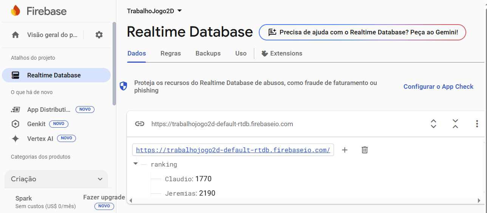
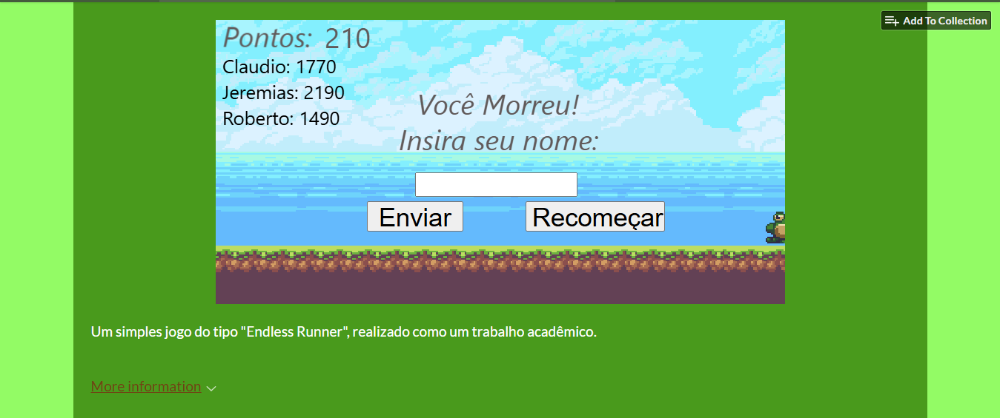

# 🦊 JogoCorridaInfinita

**"Jogo Corrida Infinita"** é um jogo digital no estilo *Endless Runner*, inspirado em jogos como o clássico dinossauro do Google Chrome. Desenvolvido como parte de um trabalho acadêmico, o jogador controla uma **raposa veloz** em uma corrida sem fim, desviando de obstáculos para alcançar a maior pontuação possível.

 

## 🎮 Demonstração

👉 Jogue agora mesmo: [vinizamara.itch.io/corrida-infinita](https://vinizamara.itch.io/corrida-infinita)

 

## 🛠 Tecnologias Utilizadas

- 🎮 [**Construct 3**](https://www.construct.net/) – Ferramenta principal para o desenvolvimento do jogo  
- 🔥 [**Firebase**](https://firebase.google.com/) – Utilizado para armazenar as pontuações no banco de dados em tempo real
- 🌐 [**Itch.io**](https://itch.io/) – Plataforma utilizada para hospedar e disponibilizar o jogo online

 

## 🧩 Como Jogar

- Controle a raposa utilizando as setas dos teclado
- Salte sobre os sapos para não perder
- Aumente sua pontuação quanto mais tempo sobreviver
- Ao fim do jogo, insira seu nome e registre sua pontuação no ranking online

 

## 📸 Imagens do Jogo

### - Página de Desenvolvimento (Construct 3)  
Ambiente de desenvolvimento e lógica de programação visual utilizadas na construção do jogo.  

### - Banco de dados (Firebase) 
Sistema de autenticação e salvamento de dados dos jogadores usando o Firebase.  

### - Jogo implementado (Itch.io)
O jogo pode ser acessado e jogado diretamente via navegador na plataforma Itch.io.  

 

## 📂 Créditos e Licença de Assets

- Este projeto utiliza **sprites de uso livre**.
- O pacote de sprites original utilizado pode ser encontrado em:  
  🎨 [https://ansimuz.itch.io/sunny-land-pixel-game-art](https://ansimuz.itch.io/sunny-land-pixel-game-art)
